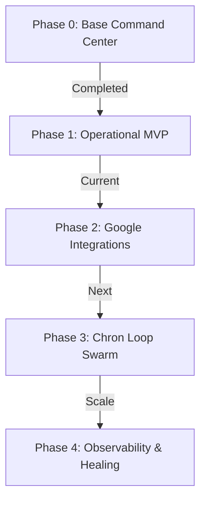

# 🗺️ Akshara World: Vision & Autonomous System Map

Welcome to the central corporate manifest and system architecture map of **Akshara World**. This document serves as the single source of truth explaining the overarching business goals, omnichannel software directory, custom operating guidelines, and the phased roadmap toward full automation.

---

## 🎯 1. Our Main Goal
The primary objective of **Akshara World** is to establish, operate, and scale a highly profitable digital business empire with **exactly ₹0 (Zero) recurring capital expenditures** (no hosting fees, no database subscriptions, and no active payroll).

The entire ecosystem is run by a decentralized swarm of specialized AI agents directed by a serverless AI CEO named **Sam**.

---

## ⚙️ 2. The Omnichannel Stack: What, Why & Alternatives

Every component in our tech stack has been specifically selected to satisfy three core criteria: **100% Free Tiers**, **Edge Performance**, and **Scalable Autonomy**.

### A. The Core Application Stack

| Software / Tool | Exact Purpose | Key Alternatives | Why It Is the Absolute Best |
| :--- | :--- | :--- | :--- |
| **Next.js 15 (App Router)** | Full-stack framework to build and host your Unified Command Center dashboard. | Remix, Astro, Vite | Edge-runtime optimized, compiles beautifully to Cloudflare Pages, and offers native SEO speed benefits with zero cold starts. |
| **React 19 & Tailwind CSS v4** | Dynamic UI rendering and sleek, high-fidelity dark-mode layout widgets. | React 18, Material UI, Bootstrap | Tailwind CSS v4 is incredibly lightweight with native CSS variables. React 19 provides concurrent rendering suited for dynamic edge pages. |
| **Cloudflare Pages & Workers** | **Pages:** Hosts the Next.js frontend globally with unlimited bandwidth.<br>**Workers:** Hosts Sam CEO's backend worker brain (`sam-brain/`). | Vercel, Netlify, AWS Lambda | **100% Free.** Cloudflare gives us unlimited bandwidth and 1 million serverless requests/day on a decentralized global edge network. |
| **Clerk Auth (with 2FA)** | Enterprise-grade secure authentication enforcing owner-only sign-ins for the dashboard. | Auth.js, Supabase Auth, Auth0 | Free up to **10,000 monthly active users** and provides pre-built, secure components requiring zero custom database setup. |
| **Razorpay** | Processing revenue transactions and feeding real-time captured payment webhooks. | Stripe, Paytm, Paypal | Standard payment gateway in India (UPI, Netbanking, Cards) featuring 0% MDR startup programs for newly registered businesses. |
| **Google Gemini 2.0 Flash** | Central AI engine driving Sam CEO's autonomous intelligence and decision loop. | OpenAI GPT-4o, Anthropic Claude | 100% free developer tier, lightning-fast response times, and a massive **1-million-token context window** to digest the entire repository. |

---

### B. The Google "Zero-Cost" Database & Asset Vault

To maintain our zero-cost commitment, we utilize Google's free-tier office software as our production database and storage layers.

#### 🗃️ Google Sheets API (Zero-Cost Database)
* **Purpose:** Acts as our primary relational database, storing customer emails, content queues, and system health status.
* **Why it's best:** Free up to **10 million cells**, acts as a visual interface you can view and edit directly from your phone, and has no database connection pool overhead.
* **Alternatives rejected:** Supabase Postgres / MongoDB (Free tiers automatically pause or delete files after a short period of inactivity).

#### 🗄️ Google Drive API (Digital Asset Vault)
* **Purpose:** File vault for storing media assets, generated scripts, blog articles, and system backups.
* **Why it's best:** **15 GB of 100% free storage** that mounts directly as a virtual drive (`G:\`) on your local PC, bridging AI assets with your desktop files instantly.
* **Alternatives rejected:** AWS S3 / Cloudflare R2 (Charge per-gigabyte and per read/write API requests, which grows expensive during heavy content generation).

---

### C. Omnichannel Traffic & SEO Engines

#### 📈 Google Search Console & Analytics APIs
* **Purpose:** Feeds live impressions, organic keywords, and visitor telemetry back to the dashboard.
* **Why it's best:** Standard market-leading telemetry. It enables our `Insight_Lab` and `Content_Forge` departments to read what search terms are trending and automatically write or edit articles to self-heal SEO ranking drops.
* **Alternatives rejected:** Ahrefs / Plausible Analytics (Require costly monthly subscriptions).

#### 🛍️ Google Merchant Center Product Feed
* **Purpose:** Dynamically generates a shopping XML feed to index digital products across Google search queries for free.
* **Why it's best:** Completely automated; requires zero manual entry or advertisement budget.

---

### D. Local Staging & Version Control

#### 💻 Ollama
* **Purpose:** Running high-performance open-source large language models (like Llama 3) locally on your PC.
* **Why it's best:** **100% private, off-grid (no internet required), and has zero token charges.** Ideal for running local tests before pushing to the cloud.
* **Alternatives rejected:** Paid local hosting applications.

#### 🚀 GitHub
* **Purpose:** Version control and continuous deployment (CD).
* **Why it's best:** Native integration with Cloudflare. **The moment code is pushed to GitHub, Cloudflare automatically builds and deploys it globally.**
* **Alternatives rejected:** GitLab / Bitbucket (Cloudflare Pages setup is slightly more complex).

#### 📁 Robocopy (Windows Utility)
* **Purpose:** Fast, multi-threaded folder synchronization between the virtual Google Drive and local SSD staging.
* **Why it's best:** Built-in, high-speed (`/MT:16`), resilient, and successfully bypasses Google Drive real-time file sync locks.

---

## 🛡️ 3. Core Business Rules & Custom Guidelines

Every developer, AI agent, and subagent working on Akshara World must strictly adhere to these core operational guidelines:

### 🥇 Rule 1: The Zero-Cost Standard
Under no circumstances should any paid or subscription service be integrated. If a feature requires payment, an open-source, self-hosted, or free-tier alternative must be identified and integrated instead.

### 📁 Rule 2: Local SSD Staging Build Protocol
Doing high-frequency file reads/writes directly in a real-time cloud synced folder (like Google Drive `G:\`) triggers `EPERM` locks and Webpack invalid filesystem write crashes. Developers must use the **Staging Build Pattern**:
1. Copy changes to the local SSD staging folder: `C:\Users\Lenovo\.gemini\antigravity\scratch\node_modules_build`.
2. Execute the npm installation and production build in local SSD:
   ```bash
   npm run build
   ```
3. Sync compiled production outputs back to `G:\My Drive\Antigravity`.
4. Keep the repository clean by excluding all local developer cache, node modules, and heavy media logs in `.gitignore`.

### ⚡ Rule 3: Webpack Path Alias Bypass
To guarantee compilation compatibility across local staging folders and global edge runtime servers:
* **Always use relative paths** (e.g. `../../components` or `../../../lib`) for all page-level and route-level file imports.
* **Avoid `@/` path aliases** inside files that undergo edge compilations.

### 🛡️ Rule 4: The 3-Try Resilience & Telegram Alerts Protocol
All remote API requests must run through our custom resilience client (`src/lib/resilience.ts`):
* If an API fails, it must automatically retry **3 times** using exponential backoff.
* If a task fails on the 3rd attempt, it must trigger a Telegram alert to you (@Sampathh7) via the Bot API, register under the "3-Try Failures" dashboard, and roll back or fall back gracefully to a cached offline store.

### 👥 Rule 5: Human-in-the-Loop Approval Queue
While the AI CEO has administrative autonomy to schedule tasks, **critical system operations** (deploying code changes, updating API tokens, or spending budget) **must be held in the Dashboard Approvals Queue** (`approvals` tab) for manual verification and confirmation by you.

---

## 🗺️ 4. Phase Roadmap to Complete Autonomy



### 📍 Phase 0 — Core Architecture (100% Completed)
- Mount virtual Google Drive staging directory.
- Scaffold Next.js dashboard UI and console scripts.
- Integrate Clerk 2FA authorization security.
- Scaffold `/sam-brain` serverless synapse on Cloudflare Workers.

### 📍 Phase 1 — Operational MVP (Current — 65% Completed)
- Resolve Webpack Google Drive EPERM lockouts via SSD Staging and disable production disk caching.
- Convert absolute imports to robust, edge-compatible relative imports.
- Integrate real-time Razorpay payments tracking and webhook endpoints.
- Configure clean `.gitignore` files to keep repository light and compile times under 1 minute.
- Set up offline-resilient backup storage and basic Telegram alerting bot.

### 📍 Phase 2 — Omnichannel Google Integrations (Next Preference)
- Build backend controllers for `googleSheets.ts` (zero-cost database) and `googleDrive.ts` (archival asset storage).
- Build `googleAnalytics.ts` endpoint to feed live SEO impressions and keyword traffic metrics back to dashboard widgets.
- Write dynamic XML generators to feed e-commerce digital products to Google Merchant Center for free indexing.

### 📍 Phase 3 — Chron Loop Swarm
- Implement central Cron scheduler APIs to run automated daily pipelines at **6:00 AM IST** without human intervention.
- Enable `Content_Forge` (SEO content engine) and `Growth_Engine` (social media publishing queues).

### 📍 Phase 4 — Edge Observability & Self-Healing
- Build automated script rollback via GitHub API if production edge builds fail.
- Trigger automatic file recovery during database sheet corruption.
- Complete system hardening for absolute hands-off, self-sustaining profitability.
