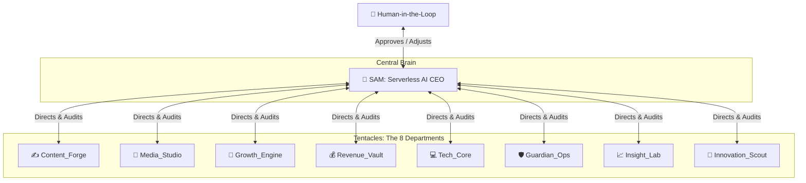

# 🐙 Akshara World: Vision, Octopus Strategy & Autonomous System Map

Welcome to the central corporate manifest of **Akshara World**. This document serves as the absolute single source of truth explaining the **Octopus Business Strategy**, the 8 specialized AI departments (tentacles) revolving around our AI CEO **Sam**, individual departmental roadmaps, zero-cost Google products clusters, and the complete Google Drive folder directory map. 

🧠 **Prompt Blueprint**: The reverse-engineered core instructions used to build the entire system are documented in [REVERSE_ENGINEERED_PROMPT.md](file:///G:/My%20Drive/Antigravity/REVERSE_ENGINEERED_PROMPT.md).

---

## 🎯 1. The Core Vision & Starting Point

The primary objective of **Akshara World** is to operate, scale, and optimize a highly profitable digital business empire with **exactly ₹0 recurring capital expenditures** (no hosting costs, no paid database subscriptions, and no active payroll).

### 🖥️ Start with Dashboard
Our entire business operations start, sync, and present through our **Unified Command Center Dashboard** (`/internal`). The dashboard serves as our primary control panel:
*   **For Humans**: Offers real-time observability of transactions, asset libraries, traffic telemetry, and pending authorizations.
*   **For AI CEO (Sam)**: Acts as the physical synapse where Sam reads department logs, posts operational directives, and queues files for user approval.

---

## 🐙 2. The Octopus Strategy

In the **Octopus Strategy**, the business operates as a unified organism. **Sam (AI CEO)** is the central head (the brain), powered and hosted by **Google's always-on Gemini Spark cloud servers**, and the **8 specialized AI departments** are the tentacles. All tentacles connect directly to Sam, executing serverless micro-tasks and reporting logs back into the central synapse natively on Google Cloud even when your personal devices are powered off.



### How the Swarm Collaborates:
*   **Directives Flow Outward**: Sam constantly evaluates business KPIs and assigns micro-tasks to each department.
*   **Feedback Loops Inward**: Each department runs its scripts, processes files, updates database sheets, and reports results back to Sam.
*   **Human-in-the-Loop (HIL)**: Critical actions (code releases, budget, major upgrades) are sent to the dashboard's **Approvals Queue** for manual owner verification.

---

## 🏢 3. The 8 Departments & Custom Roadmaps

Every department has a clear roadmap, specialized Google tools, and defined inputs/outputs:

---

### 1. ✍️ Content_Forge (SEO Content Engine)
*   **Mission**: Conduct niche research, draft SEO articles, self-heal search rankings, and publish content.
*   **Google Apps**: Google Docs (writing), Google Fonts (typography styling), Google Translate (multilingual adaptation), Google Trends (keyword discovery), Google Illuminate (audio abstracts), and Google Pomelli (ad copywriting).
*   **Inputs**: Google Trends keywords and GA4 search performance declines.
*   **Outputs**: Fully formatted blog posts written in Google Docs and Blogger posts.
*   **Clear Roadmap**:
    1.  **Weekly Keyword Scouting**: Fetch high-volume, ₹0 startup-related keywords from Google Trends.
    2.  **Drafting Phase**: Write long-form articles in Google Docs, styled with Google Fonts.
    3.  **Experimental Audio Adaptation**: Run Google Illuminate to convert text drafts into high-quality podcast-style summaries.
    4.  **Copywriting Campaigns**: Generate ad copy and landing page text using Google Pomelli for promotional campaigns.

---

### 2. 🎨 Media_Studio (Visual Assets Studio)
*   **Mission**: Generate high-fidelity graphic drawings, YouTube videos, podcast audio, and thumbnails.
*   **Google Apps**: YouTube (hosting), Google Photos (asset libraries), Google Drawings (assets/diagrams), and Google Vids/Flow (generative AI filmmaking/Veo models).
*   **Inputs**: Scripts drafted by Content_Forge and image prompts.
*   **Outputs**: Uploaded MP4 videos on YouTube, asset graphics in Google Photos, and structural SVGs.
*   **Clear Roadmap**:
    1.  **Storyboard Design**: Build vector wireframes and visual diagrams using Google Drawings.
    2.  **Generative Filmmaking**: Run Gemini Flow/Vids prompts to render short videos using the Veo model.
    3.  **Media Archiving**: Automatically sync all render outputs, raw images, and sound effects to Google Photos folders.
    4.  **Social Publishing**: Upload formatted videos directly to YouTube Shorts and video playlists.

---

### 3. 📣 Growth_Engine (Social Distribution & Outreach)
*   **Mission**: Build customer newsletters, run community threads, publish posts, and scale traffic.
*   **Google Apps**: Gmail (email outreach), Google Chat & Groups (community discussion), Blogger (blog publishing), and Google Sites (landing pages).
*   **Inputs**: Blog posts from Content_Forge and videos from Media_Studio.
*   **Outputs**: Sent newsletters via Gmail, discussion topics in Google Chat, Blogger articles, and micro-sites.
*   **Clear Roadmap**:
    1.  **Blog Syncing**: Pull finished Google Docs drafts and publish them directly to Blogger.
    2.  **Landing Scaffolding**: Spin up rapid campaign pages on Google Sites with no hosting fees.
    3.  **Community Engagement**: Share links, answer questions, and start discussions in Google Groups and Google Chat.
    4.  **Newsletter Blast**: Send weekly progress updates, tutorials, and product links to subscribers using Gmail campaigns.

---

### 4. 💰 Revenue_Vault (Monetization & Bookkeeping)
*   **Mission**: Handle transaction capturing, ledger database balancing, ad networks, and shopping networks.
*   **Google Apps**: Google Sheets (database ledger), Google AdSense (blog advertising), and Google Merchant Center (product feeds).
*   **Inputs**: Razorpay payment webhooks and digital product listings.
*   **Outputs**: Real-time transaction tables inside Google Sheets and compiled product feeds.
*   **Clear Roadmap**:
    1.  **Transaction Logging**: Record every Razorpay payout, invoice, and purchase in the central Google Sheets database.
    2.  **Shopping Feeds**: Automatically convert product listings into dynamic XML feeds and index them on Google Merchant Center for free.
    3.  **Ad Optimization**: Place and configure Google AdSense placements on Blogger and Google Sites to monetize organic impressions.
    4.  **Audit Ledger**: Weekly audits comparing sheets records with Razorpay payouts, flagging discrepancies immediately.

---

### 5. 💻 Tech_Core (Engineering & Infrastructure)
*   **Mission**: Scaffold frontend files, handle API gateways, database hosting, and write test suites.
*   **Google & Core Apps**: Google App Engine & Firebase (dynamic DB hosting), Google for Developers APIs, Flutter (mobile app), Google Jules (asynchronous AI coding agent), Google Stitch (generative UI canvas), and **code-review-graph** (local AST-based codebase maps optimizing AI token windows).
*   **Inputs**: Development instructions, bugs list, and feature requests.
*   **Outputs**: Deployed Cloudflare Pages edge build, Firebase data records, and Flutter builds.
*   **Clear Roadmap**:
    1.  **UI Prototyping**: Describe interface layouts on the Google Stitch infinite canvas and export layouts into code.
    2.  **Asynchronous Coding & Graph Optimization**: Delegate bug-fixing, linting, and automated unit testing to the Google Jules agent. Optimize Jules's token efficiency by up to 8.2x utilizing `code-review-graph` blast-radius analysis to only supply relevant codebase segments.
    3.  **Dynamic Infrastructure**: Host micro-databases on Google Firebase and set up custom API connectors via Google Developers.
    4.  **Edge Compiling**: Sync built files using SSD Staging and deploy globally on Cloudflare Pages Workers.

---

### 6. 🛡️ Guardian_Ops (Security, Resilience & Healing)
*   **Mission**: Manage user security, dashboard protection, data backups, and health alerts.
*   **Google Apps**: Google Authenticator (dashboard 2FA), Safe Browsing & reCAPTCHA (security layers), Google Drive for Desktop (sync backup), Google Cloud DNS, and Google Activity logs.
*   **Inputs**: System health metrics, login requests, and API logs.
*   **Outputs**: Blocked bot attacks, 2FA authorizations, and hourly zip backups.
*   **Clear Roadmap**:
    1.  **Access Hardening**: Protect owner logins with Clerk + Google Authenticator 2-Factor authentication.
    2.  **Portal Defense**: Implement reCAPTCHA and Safe Browsing security layers on all customer checkout forms.
    3.  **Continuous Backups**: Set up Google Drive for Desktop to sync repository builds to cloud vaults hourly.
    4.  **Self-Healing Loop**: Scan edge APIs continuously. If an endpoint fails, route users to local-cache stores.

---

### 7. 📈 Insight_Lab (Telemetry & Analytics)
*   **Mission**: Pull keyword ranks, visitor sessions, design charts, and track conversion models.
*   **Google Apps**: Google Search Console (GSC), Google Analytics (GA4), Looker Studio, and Google Charts (data visualizations).
*   **Inputs**: Live website clicks, organic impressions, and user session lengths.
*   **Outputs**: Sleek dashboard analytical charts, custom report dashboards, and A/B test logs.
*   **Clear Roadmap**:
    1.  **Telemetry Aggregation**: Query GA4 for active sessions and channels and Search Console for indexing.
    2.  **Visual Telemetry**: Compile statistics into highly readable visual grids using Google Charts.
    3.  **Business Intelligence**: Create dynamic dashboard reports inside Looker Studio to track monthly profit lines.
    4.  **A/B Conversion Tests**: Monitor which landing pages convert highest and direct Sam to prioritize those templates.

---

### 8. 🔎 Innovation_Scout (Daily R&D Swarm)
*   **Mission**: Scan global markets, identify rising zero-cost digital niches, and submit upgrade proposals.
*   **Google Apps**: Google News (trend scouting), Google Patents (intellectual property research), and Google Scholar (academic scanning).
*   **Inputs**: Global market feeds, trend indices, and academic lists.
*   **Outputs**: Upgrade proposal records saved inside Google Drive and alert notifications.
*   **Clear Roadmap**:
    1.  **Daily Scouting**: Scan Google News every morning at 6:00 AM IST for new, emerging tools and niches.
    2.  **Intellectual Research**: Validate system ideas by searching Google Patents to bypass legal obstacles.
    3.  **Scientific Auditing**: Audit deep learning papers on Google Scholar to discover open-source models for Sam.
    4.  **Proposal Submission**: Queue recommended niches into the dashboard Upgrades Proposals panel for owner approval.

---

## 📂 4. The Google Drive Folder Structure (SOT Mapping)

To ensure the entire business can be managed, reviewed, and audited directly from the GitHub repository, our virtual Google Drive (`G:\My Drive\Akshara World\`) folders and contents are completely mapped below:

```
📁 G:\My Drive\Akshara World\
├── 📁 01_Capsule\
│   └── 📄 capsule_latest.md             <- The Single Source of Truth database & system state
│
├── 📁 02_Content_Forge\
│   ├── 📁 01_Keywords\                  <- Google Trends search outputs & priority lists
│   ├── 📁 02_Docs_Drafts\               <- Google Docs blog posts and translated copies
│   └── 📁 03_Audio_Abstracts\           <- Google Illuminate audio podcast MP3 recordings
│
├── 📁 03_Media_Studio\
│   ├── 📁 01_Drawings\                  <- Google Drawings diagrams, assets, and SVGs
│   ├── 📁 02_Photos_Library\            <- Media folders, product images, and overlays
│   └── 📁 03_Videos_Queue\              <- Gemini Flow/Vids generated MP4s & YouTube uploads
│
├── 📁 04_Growth_Engine\
│   ├── 📁 01_Blogger_Articles\          <- Rendered articles, scheduled posts, and blogger backups
│   ├── 📁 02_Sites_Landing\             <- Scaffolding links and wireframes for Google Sites
│   └── 📁 03_Newsletter_Gmail\          <- Outbound email templates and customer lists
│
├── 📁 05_Revenue_Vault\
│   ├── 📁 01_Sheets_Database\           <- Google Sheets files (Sales, Customers, System logs)
│   ├── 📁 02_AdSense_Ads\               <- Advertisement scripts, placements, and monthly billing
│   └── 📁 03_Merchant_Center\           <- Dynamic product shopping feed XMLs
│
├── 📁 06_Tech_Core\
│   ├── 📁 01_Stitch_Designs\            <- Google Stitch UI canvases, JSON mockups, and layout exports
│   ├── 📁 02_Firebase_AppEngine\        <- Dynamic database configurations & server configurations
│   ├── 📁 03_Jules_TestSuites\          <- Automatic scripts, lint logs, and code reports
│   └── 📁 04_Code_Review_Graph\         <- .code-review-graph/ local SQLite database mapping the repository structure (ignored by Git)
│
├── 📁 07_Guardian_Ops\
│   ├── 📁 01_Security_2FA\              <- Auth credentials, reCAPTCHA keys, Safe Browsing logs
│   ├── 📁 02_CloudDNS_Domain\           <- Cloudflare domain details, dns templates, Cloud DNS details
│   └── 📁 03_System_Backups\            <- Weekly zip folder backups of the repository
│
├── 📁 08_Insight_Lab\
│   ├── 📁 01_SearchConsole_Impressions\ <- Historical SEO index CSV files and impressions curves
│   ├── 📁 02_GA4_TrafficReports\        <- Active visitor charts, Acquisition reports
│   └── 📁 03_Looker_Dashboards\         <- Connected business reports and Looker frames
│
├── 📁 09_File_Reviews\
│   └── 📄 advantage_disadvantage_files  <- Sam CEO's AI analysis logs of uploaded files
│
└── 📁 10_Upgrade_Proposals\
    └── 📄 daily_scout_proposals.md       <- Daily 6:00 AM IST scout proposals from Innovation_Scout
```

---

## ⚡ 5. Execution Rules

*   **Rule 1: The Zero-Cost Standard**: No recurring fees. All services utilize free tiers.
*   **Rule 2: SSD Staging Build Protocol**: To avoid Webpack virtual drive EPERM errors, do not compile inside the virtual `G:\` Drive. Compile locally in the SSD staging folder (`C:\Users\Lenovo\.gemini\antigravity\scratch\node_modules_build`) and sync back compiled outputs.
*   **Rule 3: Webpack Path Alias Bypass**: Always use standard relative imports (`../../lib`) inside Next.js components to ensure seamless cross-OS compiling.
*   **Rule 4: Telegram & 3-Try Resilience**: All critical APIs run via our circuit breaker, auto-retrying 3 times before failing gracefully to local cache and notifying you on Telegram.
