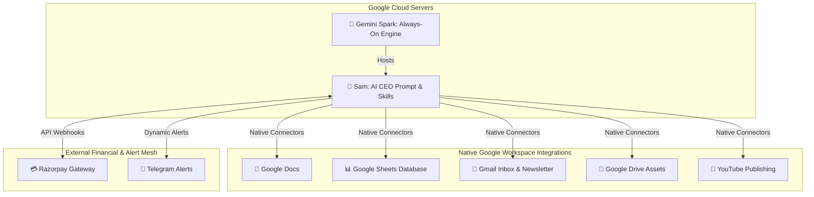

# ⚡ Gemini Spark: Always-On Cloud Integration for Sam CEO

This document defines the integration architecture for **Gemini Spark** as the always-on, cloud-based host for **Sam, the AI CEO**, replacing legacy local orchestrators (like openclaw) with Google's native cloud agent technology. 

By utilizing Gemini Spark, the Akshara World digital business empire remains fully active 24/7—executing daily automation crons, triaging incoming customer leads, sending newsletters, and balancing ledger sheets directly on Google Cloud servers even when the owner's laptop is completely closed.

---

## 🏛️ 1. Core Integration Architecture

Gemini Spark acts as the cloud engine for the **8 Swarm Departments** of Akshara World, utilizing Google's native workspace integrations to run operations at exactly ₹0 recurring infrastructure cost.



---

## ⚙️ 2. Mapping the 8 Departments to Gemini Spark Skills

We translate Akshara World’s swarm departments into reusable **Gemini Spark Skills** configured in the Gemini Connected Apps panel:

| Swarm Wing | Gemini Spark Native App Connectors | Core Skill Definition |
| :--- | :--- | :--- |
| **✍️ Content_Forge** | Google Docs + Drive + Sheets | Scans Google Trends daily, drafts long-form SEO articles in Google Docs, and logs drafts to `Akshara World Metrics`. |
| **📣 Growth_Engine** | Gmail + Google Docs | Compiles drafted articles into weekly email newsletters, sending them directly via Gmail campaigns to subscribers. |
| **💰 Revenue_Vault** | Google Sheets + Google Drive | Monitors Razorpay transactional spreadsheets, balances daily income reports, and outputs clean ledger summaries. |
| **🎨 Media_Studio** | YouTube + Google Drive | Organizes visual asset directories inside Google Drive and coordinates automatic descriptive uploads to the YouTube channel. |
| **💻 Tech_Core** | Google Drive + Cloudflare Webhooks | Manages environment templates, monitors Edge compilation outputs, and maintains system config manifests. |
| **🛡️ Guardian_Ops** | Google Drive | Bundles active repositories and pushes a compressed operational backup to secure Google Drive folders hourly. |
| **📈 Insight_Lab** | Google Sheets + Google Calendar | Pulls click metrics, calculates visual conversion rates, and schedules performance scorecard reviews. |
| **🔎 Innovation_Scout** | Google Drive + Gmail | Conducts daily sweeps for new automation methods and drafts upgrade proposals for owner review. |

---

## 🚀 3. Active Cloud Workflows (Setup Instructions)

Implement the following three high-performance automated workflows inside your Gemini Spark settings panel to activate the cloud engine:

### 📁 Workflow 1: Daily Inbox Triage & Lead Ingest
*   **Task**: Check Gmail every morning for client inquiries, feedback, and sales confirmations.
*   **Skill**: Summarize unread emails, flag messages containing terms like *urgent*, *invoice*, or *proposal*, and append details to the `Subscribers` and `DailyMetrics` tabs inside your Google Sheets database.
*   **Schedule**: **Daily at 7:00 AM IST**
*   **Result**: Zero inbox clutter. Wake up to a clean, structured summary logged in Google Sheets.

### 📧 Workflow 2: Automated Lead Auto-Responder
*   **Task**: Monitor Gmail for incoming customer contact forms and inquiry emails.
*   **Skill**: Send a polite transactional reply immediately to establish engagement, and send a high-priority alert to the administrator's Telegram bot (`@Akshara23bot`) for human review.
*   **Auto-Reply Template**:
    ```text
    Hi, thanks for reaching out to Akshara World. I have received your message and will get back to you within 24 hours with all the details you need.
    ```
*   **Schedule**: **Trigger-based** (runs instantly as new emails arrive)
*   **Result**: 100% conversion responsiveness even when your personal devices are completely powered off.

### 📊 Workflow 3: Sunday Weekly Executive Report
*   **Task**: Pull a summary of business achievements and transaction metrics.
*   **Skill**: Read Google Calendar for completed meetings, extract Gmail transactional logs, calculate total Weekly Revenue from your `Revenue_Vault` sheet, and compile a clean document inside Google Docs named `Weekly Review` with sections for *Completed Operations*, *Pending Approvals*, and *Financial Scorecard*.
*   **Schedule**: **Weekly on Sunday at 8:00 PM IST**
*   **Result**: A fully formatted, executive business report prepared for your review every Monday morning.

---

## 🔒 4. Security & Human-in-the-Loop Safeguards

To maintain strict operational security over your cloud-based AI CEO:
1.  **Direct Confirmation Prompts**: Enable "Require confirmation before sending emails" inside the Gemini Spark settings panel for any outbound public replies.
2.  **Telemetry Logs Monitoring**: Inspect the **Agent Activity Log** in the Gemini tab every 3 days to audit Sam’s executions.
3.  **Financial Sandbox**: Never connect financial or bank account integrations directly to Gemini Spark; route all payments through our verified, webhook-secured Razorpay gateway.
